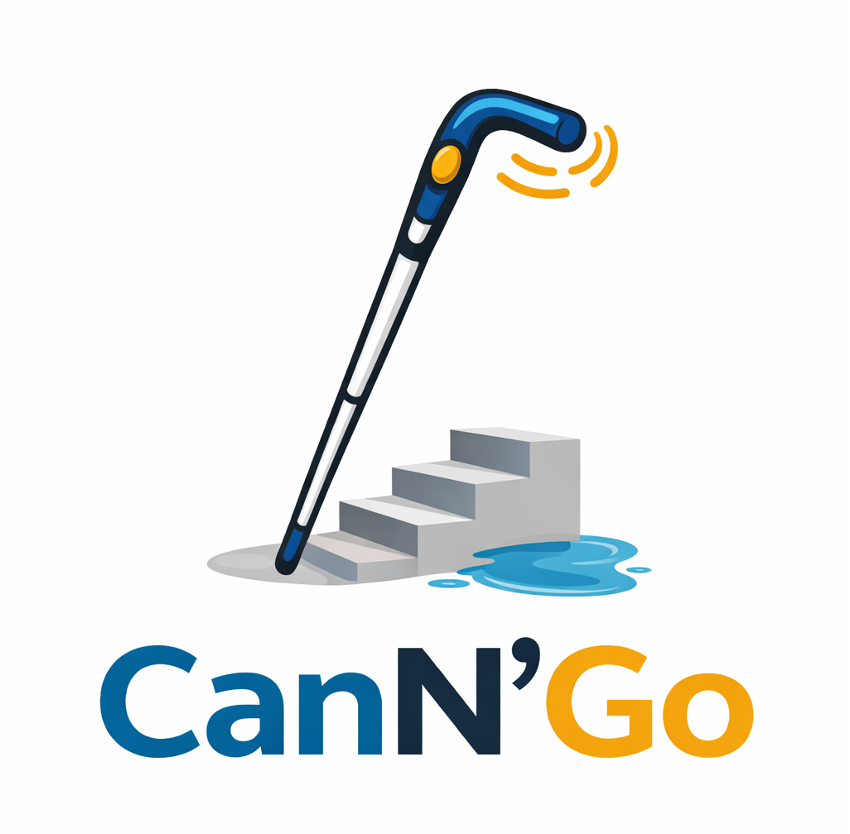
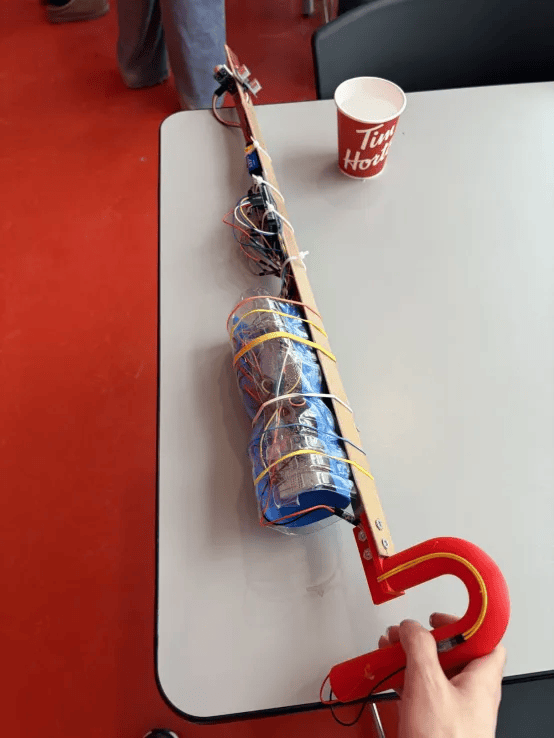

# CanN'Go - Smart Cane for Safer Mobility
**2nd Place – StarHack 2026**

## Overview
CanN'Go is a smart cane designed under a 24-hour deadline to improve mobility and safety for visually impaired users.
The system detects multiple types of hazards in real time and provides intuitive feedback through vibration and sound.

Unlike a traditional cane, CanN'Go can:
- detect frontal obstacles;
- identify dangerous ground changes such as stairs or drop-offs;
- detect water hazards on the ground.

## Prototype
*(Pictures coming soon)*

## Main Features

### 1. Frontal Obstacle Detection
An ultrasonic sensor detects obstacles in front of the user.
The cane provides **adaptive haptic feedback**: the closer the obstacle, the stronger the vibration.

### 2. Ground Change Detection
A second ultrasonic sensor points downward to monitor the ground. The system detects significant distance variation that may indicate:
- stairs;
- holes;
- sudden drop-offs;
- unsafe terrain changes.

When a ground hazard is confirmed, the cane triggers a **sound alert**.

### 3. Water detection
A water sensor detects wet surfaces or puddles.
When water is detected, the cane emits a dedicated **audio warning**.

---

## Technical Stack
- C++
- Arduino
- Embedded systems
- PWM motor control
- Ultrasonic sensors (front and downward)
- Water level sensor

---

## How It Works

### Front Obstacle Module
- Reads distance from the frontal ultrasonic sensor
- Adjusts vibration intensity based on obstacle proximity

### Ground Hazard Module
- Reads distance from the downward ultrasonic sensor
- Maintains a baseline ground distance
- Detects significant vertical change using thresholds and confirmation reads
- Triggers an audio alert when a dangerous change is confirmed

### Water Hazard Module
- Continuously reads the water sensor level
- Compares readings against a threshold
- Triggers a dedicated sound alert when water is detected

--- 

## Impact
CanN'Go improves accessibility and safety for visually impaired users by:
- detecting obstacles before contact,
- warning about dangerous terrain changes,
- identifying water hazards,
- providing intuitive feedback through vibration and sound.

---

## Future Improvements
- Improve the precision of ground hazard detection
- Explore additional assistive features such as navigation and fall detection

## Prototype

